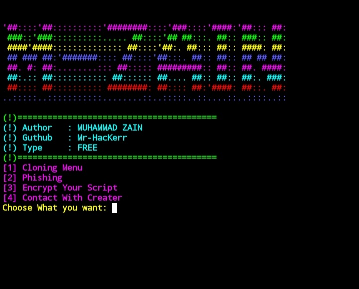

<!-- Mrphisher -->

<p align="center">
  
</p>

<p align="center">
  
  
  
  
  
</p>

<p align="center">
  
  
  
</p>


### Installation

- Just, Clone this repository -
```
$ git clone https://github.com/Mr-HacKerr/Public-Love.git
```

- Change to cloned directory and run `Run.py` -
```
$ cd Public-Love
$ python Run.py
```


##

<h3 align="center">
:: Workflow ::
</h3>
<p align="center">

</p>


### Find Me on :
<p align="left">
  <a href="https://github.com/Mr-HacKerr" target="_blank"></a>
  <a href="https://www.facebook.com/profile.php?id=100000098645074" target="_blank"></a>
  <a href="https://m.me/100065021172001" target="_blank"></a>
</p>

